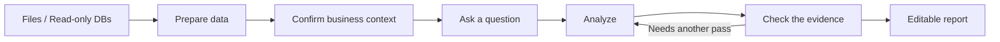

<div align="center">


# ReceiptBI

**Turn CSV, Excel, and read-only databases into verified, editable business reports.**

[Download the desktop app](https://github.com/MoonMao42/ReceiptBI/releases/latest) · [Try the sample](#try-the-sample) · [中文](README.md)

[](https://github.com/MoonMao42/ReceiptBI/actions/workflows/ci.yml)
[](https://github.com/MoonMao42/ReceiptBI/releases/latest)
[](LICENSE)

</div>


<p align="center"><sub>Interact with databases, Excel files and more via natural language (read-only). Generate charts and summaries.</sub></p>

## Try the sample

1. Install the [ReceiptBI desktop app](https://github.com/MoonMao42/ReceiptBI/releases/latest), or run it from source.
2. Download the [coffee retail order sample](examples/retail/orders.csv).
3. Choose a model provider in Settings, then add the sample file to your project.
4. Ask:

> Analyze sales, gross profit, and refunds for the latest month. Compare regions and channels.

## Download

The current version is [ReceiptBI 1.0.0](https://github.com/MoonMao42/ReceiptBI/releases/tag/v1.0.0).

<details>
<summary><strong>First launch on macOS</strong></summary>

1. Open the DMG and move ReceiptBI to Applications.
2. The current 1.0.0 build is unsigned. If macOS blocks the first launch, run in Terminal:

```bash
xattr -cr /Applications/ReceiptBI.app
```

</details>

## Features

### Full analysis process with highlights and charts


### AI-generated semantic layer per data source


### Convert to editable reports


### Preview pagination before export


<div align="center">

[⭐ Star ReceiptBI](https://github.com/MoonMao42/ReceiptBI)

</div>

## How it works



Confirmed data preparation steps and business definitions are saved. When data updates but the schema stays the same, you can reuse existing definitions to re-run analysis and refresh reports.


## Previous versions

| Version | Based on | Branch |
|---|---|---|
| v2 | [gptme](https://github.com/gptme/gptme) | [v2](https://github.com/MoonMao42/ReceiptBI/tree/v2) |
| v1 | [Open Interpreter 0.4.3](https://github.com/OpenInterpreter/open-interpreter) | [v1](https://github.com/MoonMao42/ReceiptBI/tree/v1) |

## License

[MIT](LICENSE)
